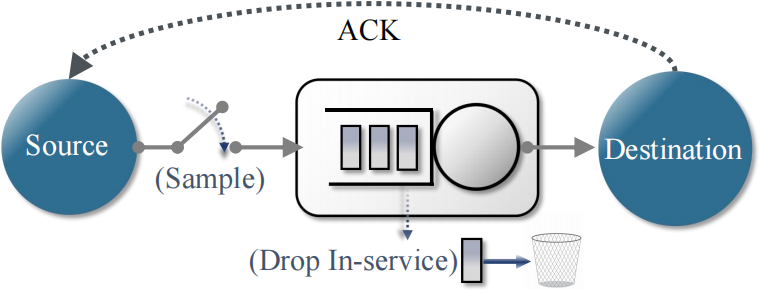

# aoi-preemption-heavy-tail

Code to reproduce **“Taming the Heavy Tail: Age-Optimal Preemption”**  
📄 **Paper (PDF)**:[https://arxiv.org/pdf/2601.16624](https://arxiv.org/pdf/2601.16624)


🌐 **Project Page:**: [https://yigiti.github.io/Preemption/](https://yigiti.github.io/Preemption/)


Continuous-time joint sampling & preemption via **PDMP impulse control**; **integral ACOE + optimal stopping**; fast **policy iteration** for heavy-tailed delays (Pareto / log-normal).


## Quickstart
Run the MATLAB scripts below to generate the main simulation outputs:

- `Paretov2.m` — experiments under Pareto service times  
- `lognormal.m` — experiments under log-normal service times

## Contact
If you encounter any issues with reproduction, feel free to reach out to me at hitliaimin@163.com.

## Citation
You may find this paper helpful
```bibtex
@article{aimin2026taming,
  title={Taming the Heavy Tail: Age-Optimal Preemption},
  author={Aimin Li, Yiğit İnce, and Elif Uysal},
  journal={arXiv preprint arXiv:2601.16624},
  year={2026}
}
