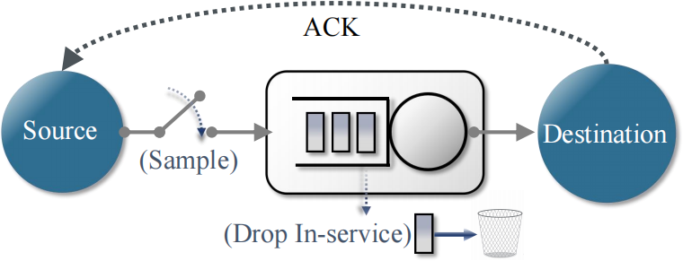

# aoi-preemption-heavy-tail

Code to reproduce **“Taming the Heavy Tail: Age-Optimal Preemption”**.

- 📄 **Paper (PDF):** https://arxiv.org/pdf/2601.16624  
- 🌐 **Project Page:** https://yigiti.github.io/Preemption/ — *A quick walkthrough of the paper (快速预览我们的文章)*



## Overview

This repository provides MATLAB code for reproducing the main numerical results accepted by IEEE ISIT 2026:

> **Aimin Li, Yiğit İnce, and Elif Uysal**  
> *Taming the Heavy Tail: Age-Optimal Preemption*, Proc. IEEE ISIT, 2026.

We study a continuous-time joint sampling & preemption problem under general (possibly heavy-tailed) service-time distributions. The system is formulated as a **PDMP impulse control** problem. By using an **integral average-cost dynamic programming principle**, the resulting coupled ACOEs reduce the busy-phase preemption decision to an **optimal stopping** problem, enabling fast **average-cost policy iteration** tailored to heavy tails (Pareto/Lomax and log-normal).

## Key Features

- Continuous-time joint **sampling + preemption** with explicit sampling/preemption penalties
- **Integral ACOE** formulation (avoids smoothness assumptions of average-cost HJB–QVI)
- Busy-phase invariance ⇒ **one-dimensional boundary** ⇒ **optimal-stopping preemption**
- Efficient **policy iteration** designed for heavy-tailed delays
- Experiments under **Pareto (Lomax)** and **log-normal** service times

## Quickstart

Run the MATLAB scripts below to generate the main simulation outputs:

- `Paretov2.m` — experiments under Pareto (Lomax) service times  
- `lognormal.m` — experiments under log-normal service times  

Tip: For reproducibility, keep the default parameter settings unless you are intentionally sweeping a specific regime.


Additional helper functions (if included) are called by the main scripts; please keep relative paths unchanged.

## Contact

If you encounter any issues with reproduction, feel free to reach out:

- **Email:** hitliaimin@163.com

## Citation

If you find this code useful, please cite:

```bibtex
@article{aimin2026taming,
  title={Taming the Heavy Tail: Age-Optimal Preemption},
  author={Aimin Li and Yi{\u{g}}it {\.I}nce and Elif Uysal},
  journal={Proc. IEEE ISIT},
  year={2026}
}
